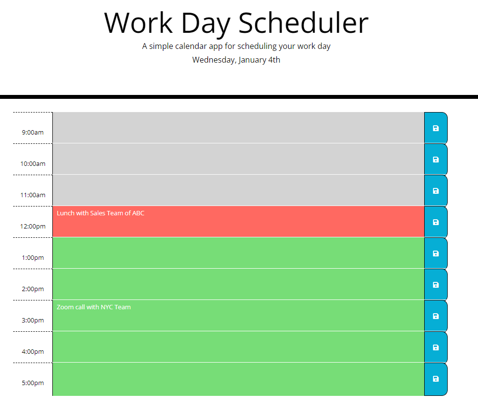

# Workday Scheduler
-	A simple calendar application that allows a user to save events for each hour of the day. The app will run in the browser and feature dynamically updated HTML and CSS powered by jQuery. It utilizes the Moment.js library to work with the date and time updates for the user. 

# Features for the App 
-----------------------------------------------------------------------  
-	Displays a daily planner for the user to create a schedule
-	When user opens the planner the current day is displayed at the top of the calendar
-	When user scroll down it presents the  timeblocks for standard business hours
-	View the timeblocks for that day and each timeblock is color coded to indicate whether it is in the past, present, or future
-	User can then click into a timeblock and enter an event
-	When user click on the save button for that timeblock, the text for that event is saved in local storage
-	Upon  refreshing the page the saved events persist for the user.

# Built with
-----------------------------------------------------------------------
-	Moment.js
-	jQuery
-	JavaScript
-	HTML  
-	CSS 

# Links
-----------------------------------------------------------------------
### [ Deployed Website](https://micky-ad.github.io/Work-Day-Scheduler/)
### [Repository](https://github.com/Micky-Ad/Work-Day-Scheduler)

# Screenshot:
----------------------------------------------------------------------

 

# Usage:
-	A simple calendar application that allows a user to save events for each hour of the workday (9am – 5:00pm).

# License:
-----------------------------------------------------------------------
[MIT](https://choosealicense.com/licenses/mit/)

